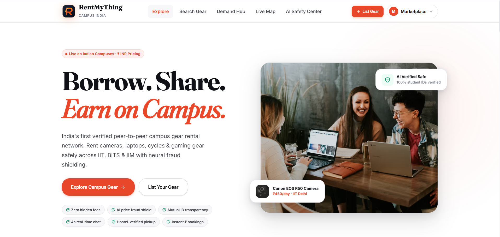
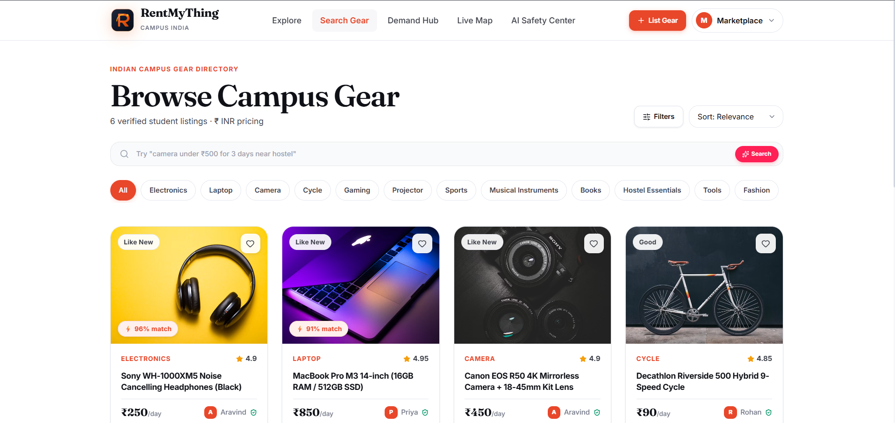
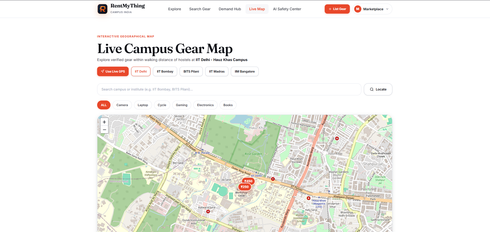
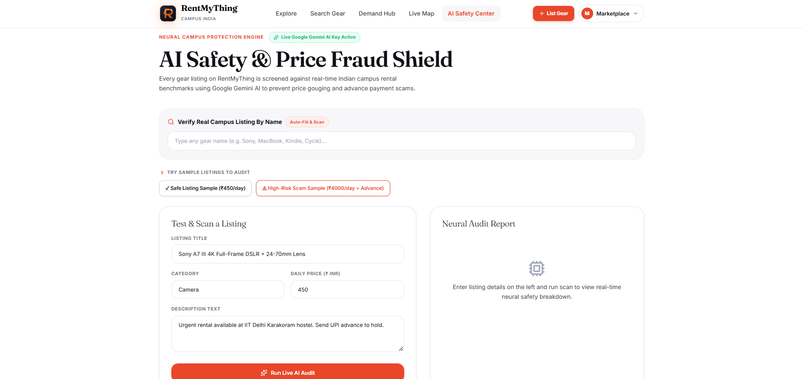

<div align="center">

# 🚀 RentMyThing

### Borrow. Share. Earn on Campus.

**India's First Verified Peer-to-Peer Campus Rental Marketplace**

[](https://rentmything-x6pb.onrender.com/)
[](https://github.com/prateekvijay265/RentMyThing)
[]()

---

### ⭐ India's First Verified Campus Rental Marketplace

Rent expensive gear from nearby verified students and earn money by renting out idle products.

</div>

---

# 📸 Project Preview

## 🏠 Homepage

<p align="center">

</p>

---

## 🛒 Smart Marketplace

<p align="center">

</p>

---

## 🗺 Live Campus Map

<p align="center">

</p>

---

## 🛡 AI Safety Center

<p align="center">

</p>

---

# ✨ Features

## 🎓 Student Verification

Only verified college students can rent or list products.

---

## 📍 Live Campus Map

Locate nearby rental items using an interactive campus map.

---

## 🔍 Smart Search

Search products by

- Category
- Campus
- Keywords
- Price

---

## 🤖 AI Safety Shield

AI scans every listing for

- Fake prices
- Scam keywords
- Advance payment fraud
- Suspicious listings

---

## 💰 Earn Passive Income

Students can monetize unused products.

Examples

- DSLR
- Laptop
- Projector
- Cycle
- Gaming Console
- Books
- Musical Instruments

---

## ❤️ Wishlist

Save products for later.

---

## ⭐ Ratings & Reviews

Build trust through verified reviews.

---

## 📱 Fully Responsive

Optimized for

- Desktop
- Tablet
- Mobile

---

# 🏗 Tech Stack

| Frontend | Backend | Database | AI | Maps |
|-----------|----------|-----------|-----|------|
| React | Node.js | PostgreSQL | Google Gemini | Leaflet |
| Next.js | Express | Prisma | Gemini API | OpenStreetMap |
| Tailwind CSS | REST API | Neon DB | AI Safety Engine | GPS |

---

# 🚀 How It Works

```text
Student Lists Gear
        │
        ▼
Verified by Platform
        │
        ▼
AI Safety Scan
        │
        ▼
Visible on Marketplace
        │
        ▼
Nearby Student Books
        │
        ▼
Secure Rental
```

---

# 💼 Business Model

### Platform Commission

5% on every successful rental.

### Revenue Sources

- Featured Listings
- Premium Sellers
- Campus Partnerships
- Rental Protection Plans
- Advertisements
- Subscription Plans

---

# 🎯 Target Users

- College Students
- Hostellers
- Clubs & Societies
- Photography Enthusiasts
- Tech Communities
- Event Organizers

---

# 🌟 Future Roadmap

- Android App
- iOS App
- QR Pickup
- UPI Escrow
- Real-Time Chat
- College Verification API
- Digital Rental Agreement
- AI Price Recommendation
- Referral Rewards
- 100+ Campus Expansion

---

# 📂 Project Structure

```
RentMyThing
│
├── client
├── server
├── docs
├── public
├── components
├── pages
├── api
└── README.md
```

---

# 👨‍💻 Team BLACKTECH

| Name | Role |
|------|------|
| **Abhishek Kumar Tiwari** | Full Stack Developer |
| **Prateek Vijay** | Frontend & Backend Developer |
| **Bhavesh Vijay Verma** | Developer |

---

# 🏆 Hackathon

## ThinkForBharat 1.0 – National Open Innovation Ideathon

RentMyThing was built as an innovative solution to make campus rentals safer, smarter, and more accessible for students across India.

---

# 🌐 Live Demo

### https://rentmything-x6pb.onrender.com/

---

# 💻 GitHub Repository

### https://github.com/blackshadowog/RentMyThing-v2

---

# 🤝 Contributing

Contributions are welcome.

1. Fork the repository
2. Create a feature branch
3. Commit your changes
4. Open a Pull Request

---

# 📜 License

This project is licensed under the MIT License.

---

<div align="center">

## ⭐ Star this repository if you like the project!

Made with ❤️ by **Team BLACKTECH**

Author - "Abhishek kumar tiwari & Prateek Vijay"

</div>
